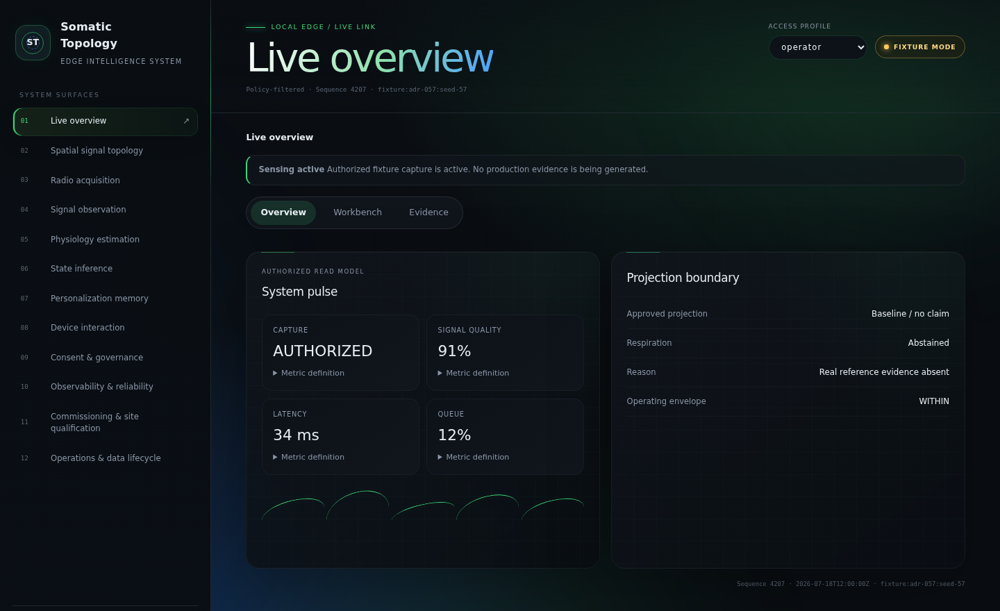
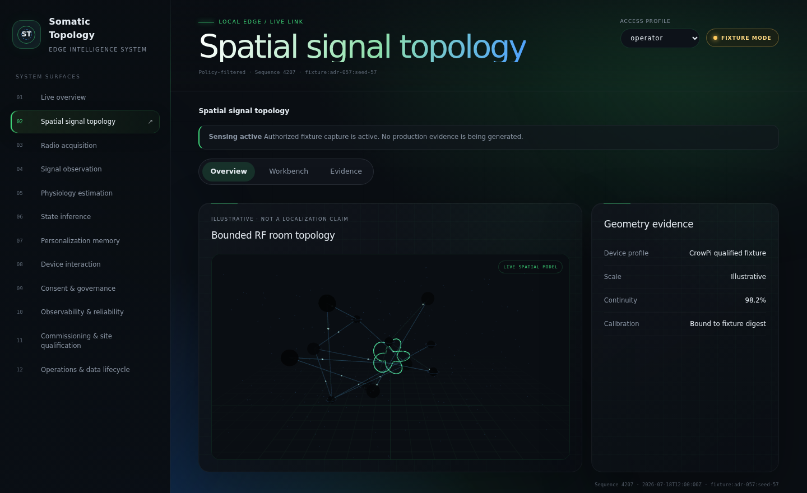

<div align="center">

# 🧠 Somatic Topology Engine

**An exocortex interface — no electrodes, no wearables, no cameras.**
Built to run on the CrowPi's onboard Raspberry Pi 4 hardware — ambient Wi‑Fi sensing, on-device Rust inference, and a local operations console. Just radio waves and math.

[](LICENSE)
[](rust-toolchain.toml)
[](#reference-hardware)
[](#release-status)
[](#privacy-by-design)

<br>



</div>

## What it is

Somatic Topology Engine (STE) is an **exocortex interface**: it turns a
Wi‑Fi radio into an ambient sensor for the room around it, instead of
putting a sensor on — or in — the person being sensed. It watches how
radio signals move through a space to observe occupancy, motion, and signal
quality, entirely from Wi‑Fi Channel State Information (CSI). No camera,
no microphone, no electrodes, nothing worn on the body.

It's purpose-built for the **CrowPi kit's onboard Raspberry Pi 4** — the
Wi‑Fi radio that does the sensing, and the OLED, RGB LEDs, capacitive touch
strip, and DHT11 sensor that give the room's occupant a physical,
human-readable sense of what the system is doing. See
[Reference hardware](#reference-hardware) below.

Everything runs **locally, on the device, in Rust** — no cloud round-trip,
no raw signal ever leaves the box. Every capability is consent-gated,
purpose-bound, and time-limited, and every estimate the system isn't
confident about is **abstained** rather than guessed: the UI says `no claim`
instead of making one up. That matters here specifically because the
long-term research target is ambitious — ambient inference of cognitive
load, emotional valence, and decision-making phase from CSI micro-tremor,
breathing pattern, and cardiac coherence, entirely wearable-free. That's a
frontier the wider BCI field has mostly approached with implants or EEG
headsets. STE's bet is that it's reachable from radio waves alone — but
only honestly, one validated layer at a time. See
[What ships today vs. the research target](#research-target) for exactly
where that line currently sits.

It ships with a local, role-aware web console for operating, validating,
and auditing the system in real time — no external dashboard, telemetry
pipeline, or third-party service required.

## What ships today

- **Sensing** — captures and windows Wi‑Fi CSI to observe occupancy,
  motion, and signal quality in a room.
- **Physiology estimation** — derives conservative, uncertainty-aware
  respiration candidates, fails closed, and refuses to output a number it
  can't stand behind.
- **State inference** — projects a policy-approved, evidence-bounded read
  model instead of an opaque black-box score.
- **Personalization memory** — builds a per-participant, cryptographically
  scoped memory of "anchors": a reference point the occupant sets with a
  single touch on the capacitive strip, and the system's estimates are
  reasoned about relative to it. Memory never mixes across participants.
- **Device interaction** — drives the OLED, RGB status LEDs, and the touch
  strip so the room's occupant always has a physical signal of what the
  system is doing and sensing right now.
- **Consent & governance** — every session is purpose-bound, scoped, and
  revocable in one action; nothing is captured outside an active
  authorization.
- **Local operations console** — a role-based web UI (participant,
  operator, support, validation, security, release) for live monitoring,
  replay, commissioning, and guarded operator workflows.

<a id="research-target"></a>

<details>
<summary><strong>🎯 What ships today vs. the research target</strong></summary>
<br>

STE's console has an explicit "claim boundary" — what it will and won't
assert — and it says so out loud instead of quietly overclaiming:

| Capability | Status |
| --- | --- |
| Occupancy, motion, signal quality | Live |
| Respiration candidate | Live, conservative, abstains without reference evidence |
| Task-workload / baseline state projection | Experimental, isolated, out-of-distribution gated |
| Emotional valence | **Not implemented** — explicitly labeled `NO CLAIM` in the console |
| Decision-making phase | **Not implemented** — explicitly labeled `NO CLAIM` in the console |
| Cognitive load (as a named, validated construct) | Research target, not a shipped claim |

The console's own inference view literally renders `Valence: Not
implemented` and `Decision phase: Not implemented` rather than a
plausible-sounding number, and the physiology estimator shows `ABSTAINED`
rather than guess a respiration rate without a validated reference sensor
to check itself against. That's a deliberate fail-closed design, not a
missing feature — see
[Privacy, safety & research scope](#privacy-by-design).

</details>

<a id="reference-hardware"></a>
## Reference hardware: the CrowPi

STE is built specifically for the **CrowPi kit**, running on its onboard
Raspberry Pi 4 — not a generic PC or SBC. The CrowPi is what makes the
wearable-free pitch possible: every sensing and feedback surface STE needs
is already wired into one board.

| Component | Reference spec | Role |
| --- | --- | --- |
| Compute | Raspberry Pi 4 (onboard, inside the CrowPi kit) | Runs the entire Rust stack locally |
| Wi‑Fi chipset | Broadcom BCM43455 (CSI-capable via patched firmware) | The only sensor STE needs — no camera, no wearable |
| OLED display | CrowPi-integrated | Shows live sensing/claim status |
| RGB status LEDs | CrowPi-integrated | Ambient, glanceable system status |
| Capacitive touch strip | CrowPi-integrated | The system's only input — a single touch sets a personalization anchor |
| DHT11 temperature/humidity sensor | CrowPi-integrated | Ambient environmental covariate |
| Network | Dedicated 5 GHz access point, fixed channel and bandwidth | CSI capture path |

No standard PC or SBC offers this exact sensing-plus-feedback combination
pre-wired, which is why the CrowPi is the reference deployment rather than
an incidental choice.

The same codebase also runs entirely in a deterministic **fixture /
simulator mode** on a laptop or CI runner — with no physical hardware
attached — for development, demos, and testing.

<details>
<summary><strong>📸 Product tour — more screenshots</strong></summary>
<br>

The console covers sixteen role-scoped areas: live overview, spatial
topology, radio, observations, physiology, inference, personalization,
device interaction, consent, validation, models, reliability, commissioning,
operations, security, and release readiness.



*Spatial signal topology — an illustrative, non-localization view of the
sensed environment, rendered live in the browser.*

</details>

<details>
<summary><strong>🚀 Getting started</strong></summary>
<br>

**Requirements:** the Rust toolchain pinned in `rust-toolchain.toml`, and
Node.js for the local console.

Build and verify the Rust workspace:

```sh
cargo build --workspace --locked
cargo test --workspace --all-targets --locked
cargo clippy --workspace --all-targets --locked -- -D warnings
bash scripts/verify.sh
```

Run the local operations console in fixture/simulator mode (no hardware
required):

```sh
cd ui
npm ci
npm run dev
```

Build and gate the production console bundle:

```sh
bash scripts/validate-ui.sh
```

See [`docs/operations/local-ui.md`](docs/operations/local-ui.md) for local
development details.

</details>

<details id="privacy-by-design">
<summary><strong>🔒 Privacy, safety & research scope</strong></summary>
<br>

- **Not a medical device.** STE is research infrastructure. Its outputs must
  never be interpreted as a diagnosis or clinical advice.
- **Consent-gated by design.** Sensing only runs inside an active,
  purpose-bound, time-limited authorization, and can be revoked in a single
  action that stops capture immediately.
- **Local-only data.** Raw signal data and derived evidence stay on-device.
  Nothing is uploaded, and no vendor telemetry is collected.
- **Fails closed, not open.** When the system isn't confident in an
  estimate, the interface reports an explicit `no claim` / `abstained`
  state rather than a plausible-looking guess.
- **Participant-scoped memory.** Personalization data is cryptographically
  scoped per participant; cross-participant queries are prohibited outright.

</details>

<details id="release-status">
<summary><strong>🧭 Release status</strong></summary>
<br>

STE is under active development. The current production release decision is
**`NOT_APPROVED`** — software controls alone cannot substitute for
hardware-in-the-loop testing, human validation, legal/jurisdictional review,
a commercial pilot, penetration testing, and an accessibility review. The
console always displays this status and cannot override it.

</details>

<details>
<summary><strong>📄 License</strong></summary>
<br>

Licensed under the [MIT License](LICENSE).

</details>
